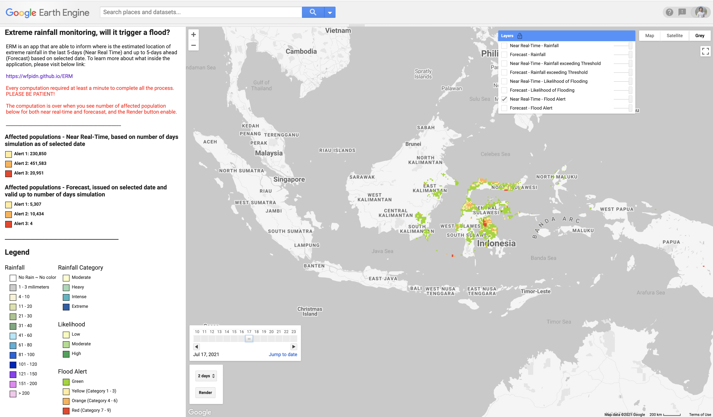

# Extreme rainfall monitoring, will it trigger a rainfall?

Extreme Rainfall Monitoring (ERM) is an experimental tool developed by the United Nations [World Food Programme](https://www.wfp.org/countries/indonesia) in Indonesia written in [Google Earth Engine](https://earthengine.google.com) (GEE) platform. ERM are able to inform where is the estimated location of extreme rainfall and its impact to population and crop in the last 5-days and forecast up to 5-days ahead based on selected date.

Some of the input was prepared via different platform: ArcGIS Pro, R Statistics, and Excel. ERM module is part of Vulnerability Analysis and Monitoring Platform for Impatc of Regional Events ([VAMPIRE](http://vampire.pulselabjakarta.org)) hazard monitoring module. Some of the analysis has been modified and adjusted to GEE based on data availability and considering the computation resources within GEE. While the methodology written in this document still reflecting what we developed in VAMPIRE.

This is the single-source documentation for ERM. It is intended to be a thorough, living document detailing the background, objective, data, method and output of ERM. If you find a mistake, please open an issue.

ERM model developed by Benny Istanto and [Prof. Rizaldi Boer](https://scholar.google.com/citations?hl=en&user=jTPXEp8AAAAJ) of Climatology Laboratory - [Bogor Agricultural University](https://ipb.ac.id) as Scientific Advisor.

### Documentation

**Work in progress!**

[https://wfpidn.github.io/ERM](https://wfpidn.github.io/ERM)

### Demo

We are still working to publish the script into Google AppEngine Application Platform.

### Contact

For further information about Extreme Rainfall Monitoring, please contact:

**Benny Istanto** 
Earth Observation and Climate Analyst 

Vulnerability Analysis and Mapping Unit 
UN World Food Programme 
Jakarta, Indonesia 

E. [benny.istanto@wfp.org](mailto:benny.istanto@wfp.org) 

