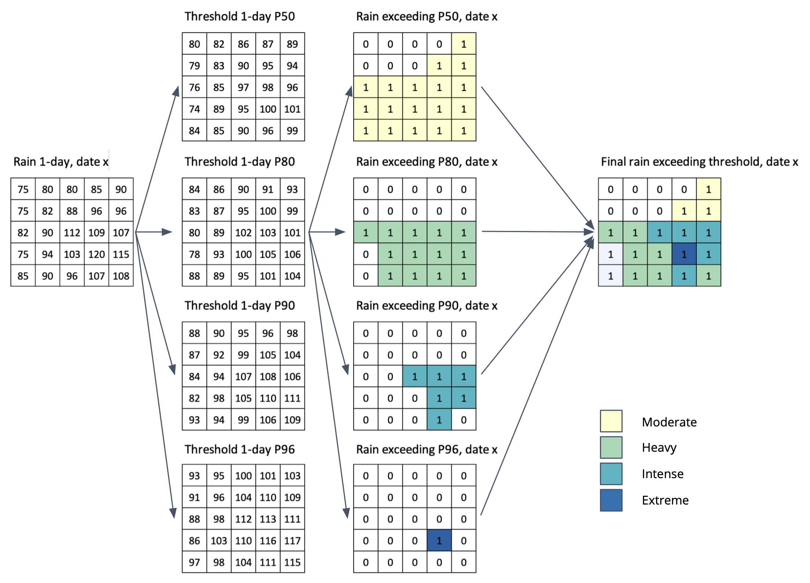

# Extreme rainfall calculation

Extract rainfall exceeding the threshold for 1 to 5-days

- 1-day

	- IF RAIN-A~1day~ > Threshold_P50, THEN extract to new file RAIN-B~p50~ and classified as Moderate `#ffffcc` 

	- IF RAIN-A~1day~ > Threshold_P80, THEN extract to new file RAIN-B~p80~ and classified as Heavy `#a1dab4` 

	- IF RAIN-A~1day~ > Threshold_P90, THEN extract to new file RAIN-B~p90~ and classified as Intense `#41b6c4` 

	- IF RAIN-A~1day~ > Threshold_P96, THEN extract to new file RAIN-B~p96~ and classified as Extreme `#225ea8` 

	- Combine all result RAIN-Bp50 - RAIN-B~p80~ - RAIN-B~p90~ - RAIN-B~p96~ into single file RAIN_B with information on rainfall value and class, with condition: 

		if in certain location (x,y) experience more extreme categories (P50<P80<P90<P96), the area is excluded in other less extreme categories. 
         
- Repeat the process for 2-days to 5-days period.

Picture below illustrate above step.

